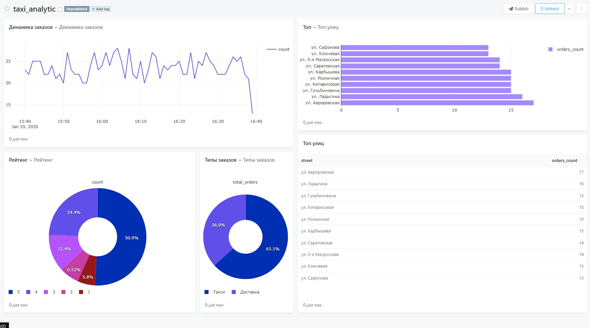

**Аналитика и визуализация служб такси**

Проект имитирует работу системы сервиса такси. Он генерирует достаточно реалистичные заказы в реальном времени, сохраняет их в базу данных и предоставляет аналитический дэшборд.

## Логика генератора
* Генератор (`generator/main.py`) создает поток заказов с реалистичными параметрами:
* **Неравномерная нагрузка**: Интервал между заказами варьируется (имитация нагрузки и затишья).
* **Типы услуг**: "Такси" заказывают чаще (65%), чем "Доставку" (35%).
* **География**: Используется реальный список улиц Владивостока.
* **Рейтинг**: Вероятность высокой оценки зависит от длины поездки.

## Redash
* В дэшборде реализован мониторинг ключевых метрик:
1. **Динамика заказов (Line Chart)**: Отображает колебания спроса в реальном времени.
2. **Тип заказов (Pie Chart)**: Соотношение такси и доставки.
3. **Топ улиц (Bar Chart)**: 10 самых популярных улиц подачи.
4. **Рейтинг (Bar Chart)**: Распределение оценок пользователей.

## Запуск проекта
* **docker-compose up**

(Только первый запуск) Инициализация базы данных Redash:
**docker-compose run --rm redash create_db**

## Доступы Redash
* **URL: http://localhost:5000**

**Параметры для создания Data Source:**
* **Host:** db
* **Port:** 5432
* **User:** Tsuki
* **Password:** 545610
* **Database Name:** taxi_db

